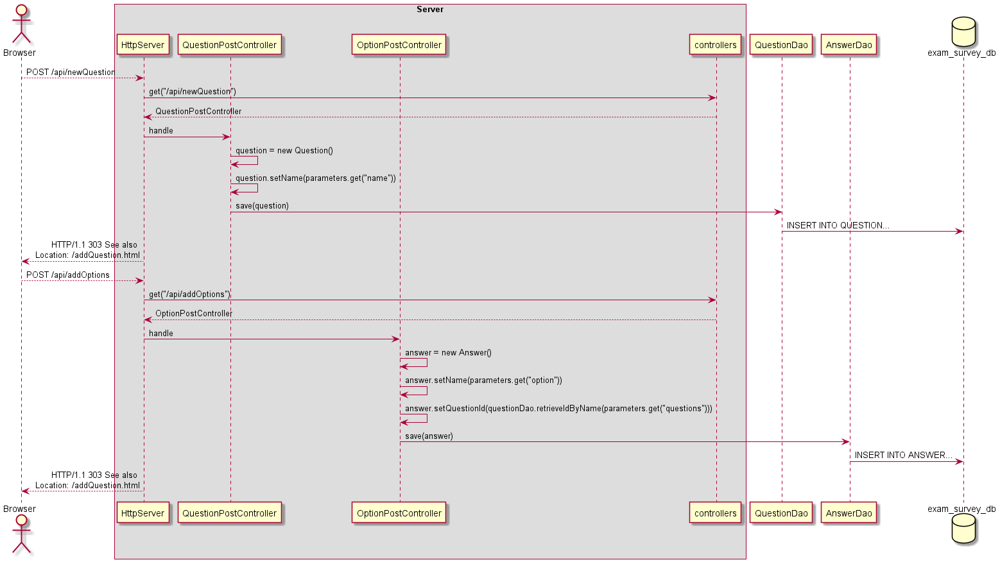
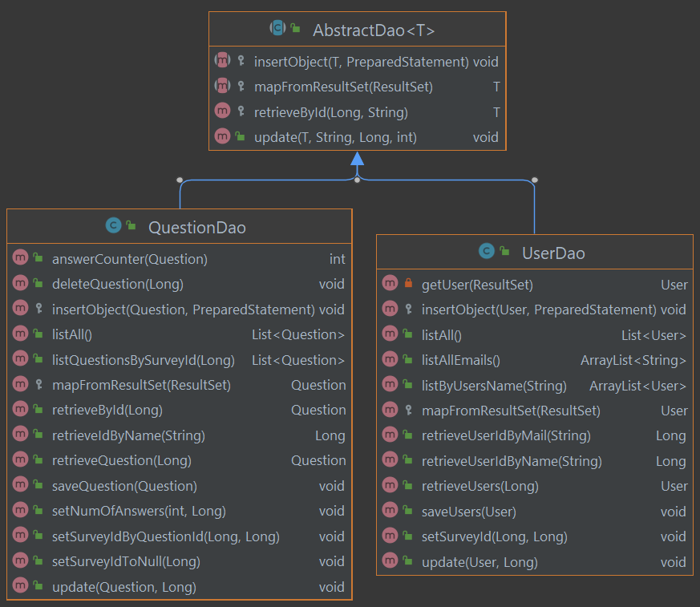
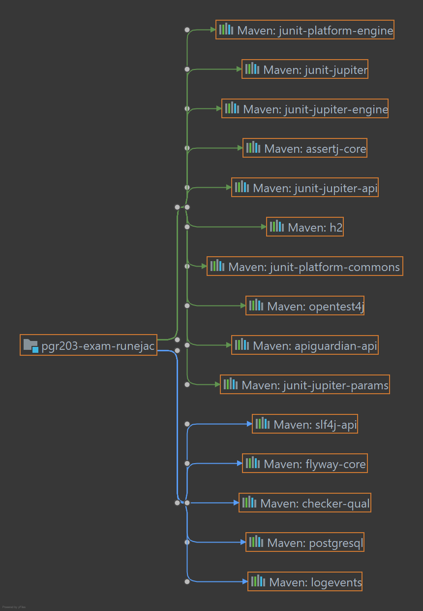

Eksamen i samarbeid med Rune Jacobsen (https://github.com/runejac)

### SURVEY MANAGER

Diagram som viser hva som skjer når man legger til spørsmål og svar.

Bildet viser hvordan vi har brukt AbstractDao.java for å refactore og bruke både retrieve og update.
Vi fikk dog ikke til insert på denne måten da noen av testene ikke ville kjøre, men funksjonaliteten fungerte med insert via AbstractDao, fjernet for å minimere duplikat av metoder.

Bildet viser våre dependencies brukt i denne eksamen.

# Dette er vår eksamen i PGR203 H2021 ved Høyskolen Kristiania. 

### Programmet kjøres ved å 
1. Kjør Maven clean
2. Kjør Maven package for å opprette en kjørbar .jar-fil
3. Vær oppmerksom på at du trenger en pgr203.properties-fil, som inneholder følgende:
   - dataSource.url=
   - dataSource.username=
   - dataSource.password=

Url'en man skal gå til dukker opp i terminalen etter .jar-filen er kjørt.
Her kan man 
1. Registrere en bruker
2. Endre bruker
3. Legge til eller slette spørsmål
4. Endre spørsmål
5. Legge til svaralternativer i spørsmålene
6. Liste ut alle spørsmålene m/svaralternativer som er lagt til
7. Opprette en spørreundersøkelse, der man legger til de spørsmålene man ønsker
8. Ta en spørreundersøkelse (her får man også valget å slette en spørreundersøkelse)

## EKSTRA FUNKSJONALITET
1. Dersom man går til localhost:*port*, så får man index.html, istedenfor at man må skrive localhost:*port*/index.html i URL-feltet
2. Ved POST redirectes man gjennom bruk av 303 See also og Location-header
3. CSS fungerer alle steder
4. Kan slette spørsmål, og da slettes automatisk de tilknyttede svaralternativene
5. Kan endre på spørsmål
6. Kan slette spørreundersøkelser, og da settes survey_id til de tilknyttede spørsmålene til null
7. Tegn som "ÆØÅ" aksepteres gjennom bruk av URLDecoder.decode()
8. Det er mulig å registrere en bruker, men cookies er dessverre ikke benyttet i dette enda, kun via JavaScript
9. Bruk av Controller.PATH for å utelukke String-feil (PATH kommer kun fra ett sted)
10. Laget et PlantUML-diagram som viser hvordan programmet fungerer når man legger til spørsmål og svar
11. Ved bruk av funksjonalitet skrives det melding til bruker i terminal om hva som blir gjort, via dependencyen "slf4j-api"
12. Mulighet for å oppdatere brukeres fornavn, etternavn og e-post. Merk at dersom man trykker submit med en eksisterende e-post i input, 
så får man et exception, men serveren kræsjer ikke

### EGENEVALUERING

Vi opplever begge at vi har lært ekstremt mye av denne eksamenen. Til tross for mye frustrasjon har det vært
svært interessant å jobbe så intenst med Java som vi har gjort de siste ukene. Det føltes en stund som om hver gang vi 
fikk på plass en bit av puslespillet, så dukket det opp et helt nytt og langt mer komplisert puslespill, men mot slutten
falt brikkene relativt godt på plass. Vi har parprogrammert mye, og det å kunne arbeide på et prosjekt samtidig som en annen, 
uten å komme for mye i veien for hverandre, ser vi på som verdifull lærdom. Oftest har vi sittet i voice chat på Discord og jobbet
hver for oss, men dermed alltid hatt mulighet til å lufte tanker og ideer om det har vært nødvendig.

#### HVA VI GJORDE BRA

Etter en del vansker her og der er vi blitt svært fornøyde med prosjektet. Spesielt kan vi trekke frem god test-dekning,
god bruk av hjelpemetoder, og en god forståelse av controllere. En del ting er løst på en måte som for oss oppleves
rimelig kreativt, og vi synes selv vi har solid kontroll på lesbarhet, variabelnavn og kodestruktur. Noe av den ekstra funksjonaliteten, 
for eksempel redirecting, gjorde at vi nå kan en del mer om headere og statuskoder, hvilket vi kan ta med oss videre.
Vi fikk på plass metoder for å slette både spørsmål og spørreundersøkelser, noe vi så for oss ville bli mer utfordrende enn det var
da vi først begynte på prosjektet. Vi har også lært en del om database-tabeller og tolkning av exceptions.

#### HVA VI KUNNE GJORT ANNERLEDES

Tidspress ble etterhvert en stor faktor, men dersom vi kunne gjort alt på nytt ville vi nok fokusert mer på å
få på plass de grunnleggende funksjonalitetene i prosjektet før vi begynte på ekstra funksjonalitet. En del tid gikk med til
å forsøke å få favicon til å fungere, hvilket vi ikke klarte. En del mer validering kunne nok vært fordelaktig, men
serveren i prosjektet har hvertfall noen hindere for å stoppe den fra å kræsje i de fleste tilfeller. Det vi har opplevd som mest utfordrende
er nok selve størrelsen på prosjektet, at jo mer man jobbet jo lengre unna virket målstreken, fordi vi stadig oppdaget nye ting
som måtte komme på plass. Ingen av oss har gjort et prosjekt på denne størrelsen før, hvilket helt sikkert synes i resultatet, 
spesielt for det trente øyet. Likevel er vi godt fornøyde med egen innsats.

